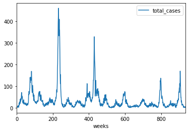

# Predição de Numero de Casos de Dengue

Para o projeto da disciplina de "Dados, Inferencia e Aprendizagem" 
ministrada no 2o Semestre de 2019 pelos professores 
José Cândido Silveira Santos Filho e Flavio du Pin Calmon, 
escolhemos um desafio público de predição do numero de casos de dengue
baseado na série histórica das cidades de San Juan, Porto Rico e Iquitos, Peru.
O desafio é oferecido pela plataforma DrivenData [1](#drivendata) 
e a descrição completa do desafio está disponivel no 
[site oficial do desafio](https://www.drivendata.org/competitions/44/dengai-predicting-disease-spread/)

Consideramos que apesar de se tratar de uma competição, em que não temos
acesso aos dados de teste e que estamos sujeitos aos 
[regulamentos da competição](https://www.drivendata.org/competitions/44/dengai-predicting-disease-spread/rules/),
a escolha desse desafio está de acordo
com a filosofia da disciplina pois provem aos alunos 
uma ótima oportunidade de aplicar ferramentas de inferência
em um problema real e de relação direta às suas vidas cotidianas,
visto que até junho de 2019 já foram confirmados mais de 18,000 casos
de dengue na cidade de Campinas[2](#denguecampinas)

## Dados 
Os dados são representados por uma série temporal com resolução semanal
e 21 atributos contendo localização, dados meteorológicos
e de vegetação agregando 4 fontes distintas.

San Juan, Puerto Rico      |  Iquitos, Peru
:-------------------------:|:-------------------------:
          |  

## Modelo
O problema proposto utiliza a métrica de erro absoluto médio (norma $l_1$)

Tradicionalmente a analise de séries temporais utiliza modelos 
auto-regressivos da família ARMA(Autoregressive–moving-average)[3](#modelosautoregressivos),
a partir de uma pesquisa preliminar (ver [apendice](#apendice)) de estudos
de predição de casos de dengue e malaria, temos que o modelo mais comum são
os modelos (S)ARIMA com método de otimização Box-Jenkins[4](#boxjenkins).
Porém, estes modelos dependem de suposições fortes de estacionariedade 
dos dados e os exemplos encontrados lidam com um espaço
de atributos muito menor (até 4) do que o nosso (21 atributos).

Também é do interesse do grupo a exploração de modelos baseados em redes neurais
mas devido ao grande número de opções ainda não temos candidatos específicos.

<a name="drivendata">1</a>: Bull, Peter, Isaac Slavitt, and Greg Lipstein.
"Harnessing the power of the crowd to increase capacity for data science in the social sector."
 arXiv preprint arXiv:1606.07781 (2016).

<a name="denguecampinas">2</a>: https://g1.globo.com/sp/campinas-regiao/noticia/2019/06/03/campinas-confirma-4a-morte-por-dengue-e-numero-de-infectados-pelo-virus-aumenta-12percent.ghtml

<a name="modelosautoregressivos">3</a>:https://en.wikipedia.org/wiki/Autoregressive%E2%80%93moving-average_model

<a name="boxjenkins">4</a>:https://en.wikipedia.org/wiki/Box%E2%80%93Jenkins_method

# Apendice
https://www.arca.fiocruz.br/bitstream/icict/26315/2/oswaldoG_cruz_etal_IOC_2018.pdf
Predição mensal dos casos de dengue no brasil utilizando modelo ARIMA. Não utiliza nenhum outro tipo de dado.

https://bmcpublichealth.biomedcentral.com/articles/10.1186/1471-2458-9-395
Predição mensal dos casos de dengue na China utilizando relação com dados meteorológicos
Parece meio fraco, mas pelo menos da pra usar us métodos de inspiração.

https://www.researchgate.net/publication/51205747_Time_series_analysis_of_dengue_incidence_in_Guadeloupe_French_West_Indies_Forecasting_models_using_climate_variables_as_predictors
Dados semanais de dengue, Modelo SARIMA para correlação com dados meteorológicos

https://www.semanticscholar.org/paper/Time-series-analysis-of-dengue-incidence-in-Rio-de-Luz-Mendes/040f77869aee49744e557e25cc69239bac606514
Dados mensais de dengue, Modelo ARIMA para regressão em séries temporais sem outros dados.

https://apps.who.int/iris/handle/10665/170465
Dados mensais de dengue, Modelo SARIMA, regressão sem outros dados.

https://www.ncbi.nlm.nih.gov/pmc/articles/PMC5307250/
Malaria